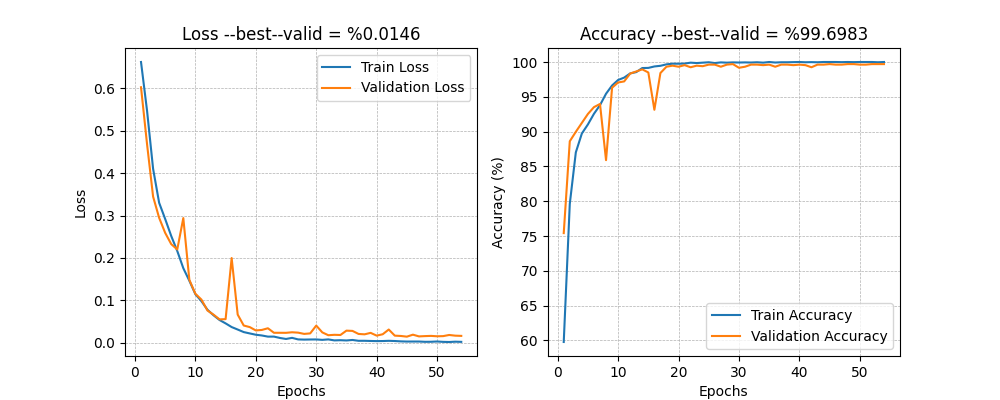
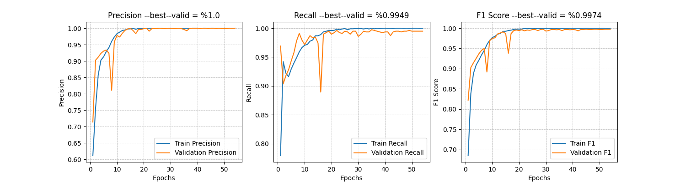
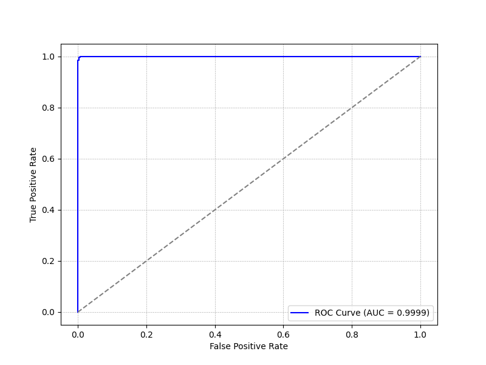
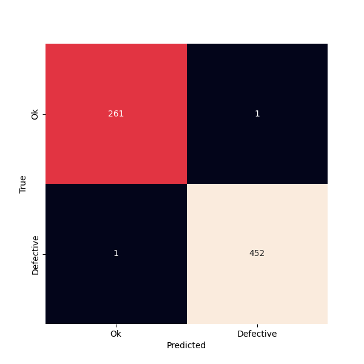

# Automated Casting Defect Detection with Deep Learning

This project aims to revolutionize the casting manufacturing industry by automating the defect detection process. Traditionally, this task is performed manually, which is time-consuming, labor-intensive, and prone to human error. To address these challenges, I have developed a deep learning model on the ResNet-18 architecture.

---

## Model Evaluation

### Accuracy and Loss

---

## Percision, Recall and F1-score

---

## Receiver Operating Characteristic (ROC) Curve with threshold=0.1

---

## Confusion Matrix with threshold=0.1

