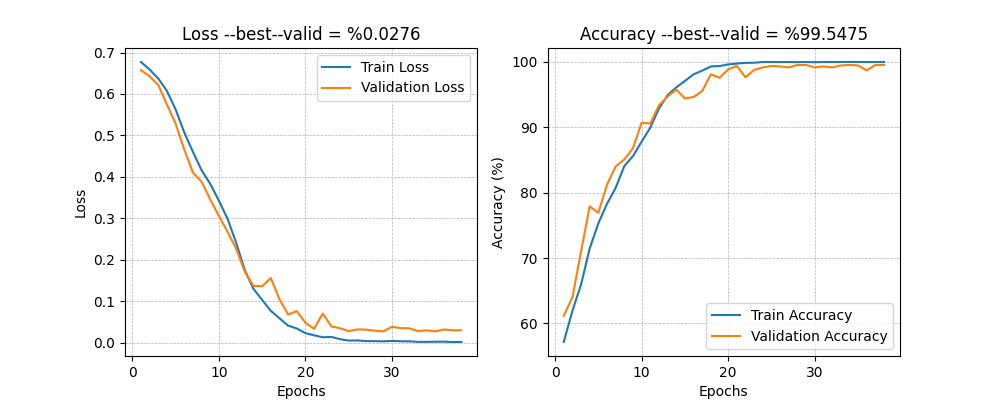
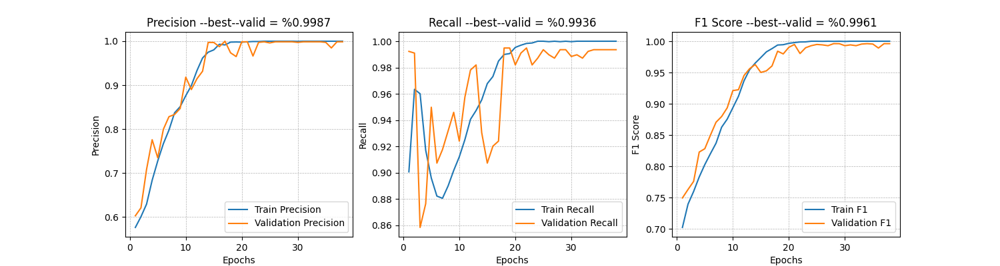
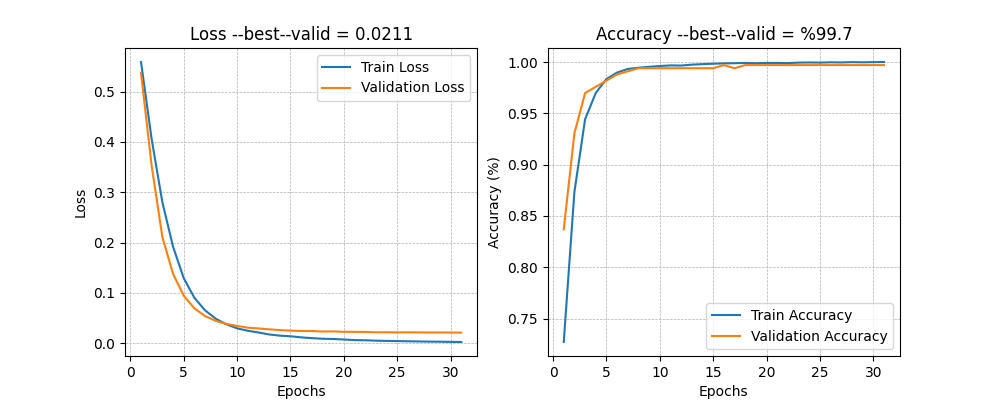
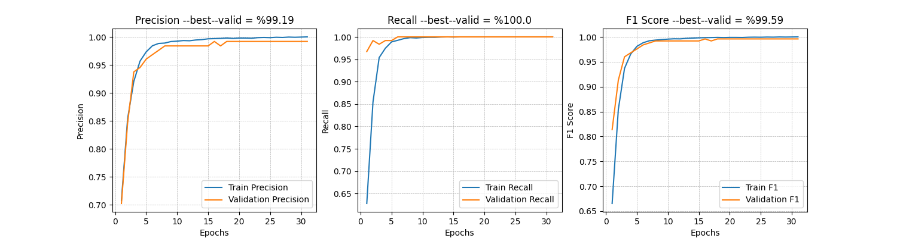
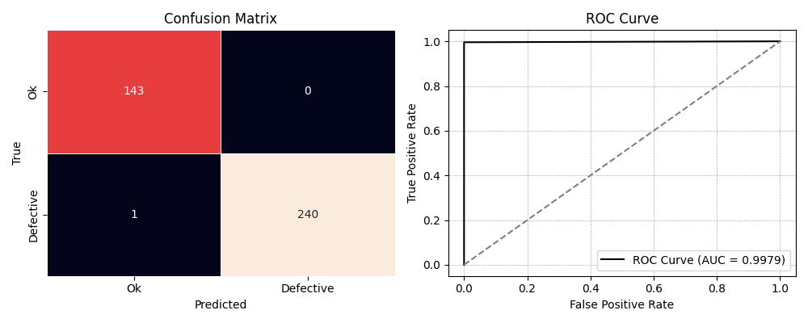
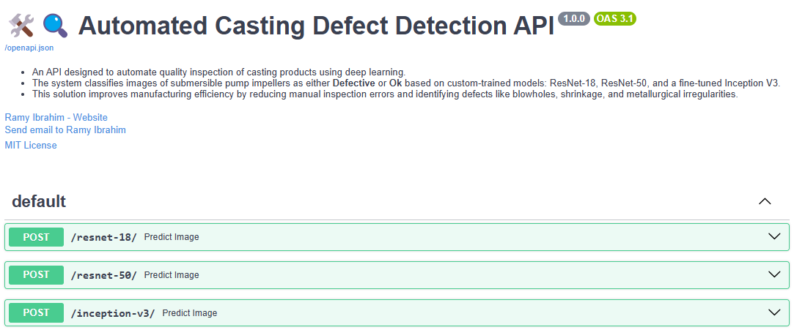

# Automated Casting Defect Detection

**Project Overview**
This initiative seeks to transform the casting manufacturing industry by automating the defect detection process. Traditionally, this task relies on manual inspection, which is not only time-consuming and labor-intensive but also susceptible to human error. To overcome these limitations, I have developed and implemented a deep learning-based solution using state-of-the-art architectures: ResNet-18, ResNet-50, and a fine-tuned Inception V3 model.

**Impact and Benefits**  
This solution enhances manufacturing efficiency by:

- Minimizing manual inspection errors.  
- Accelerating the defect detection process.  
- Enabling early identification of flaws to reduce production waste and costs.  

---

## ResNet-18

---

## ResNet-50

---

## Inception-V3

---

## Deployment  

To ensure a seamless and efficient deployment process, I utilized modern development tools and frameworks:  

**REST--APIs**  
   The trained models (ResNet-18, ResNet-50, and fine-tuned Inception V3) were deployed using **FastAPI**, enabling a robust and high-performance API for defect detection.  

**Containerization**  
The application was fully containerized using Docker and Docker Compose, ensuring:  

- Portability across environments.  
- Simplified deployment and scaling.  
- Streamlined dependency management.

---
